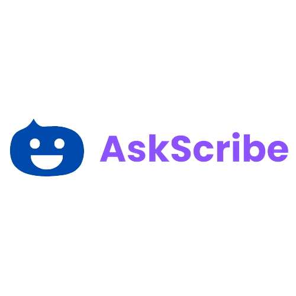

<br />
<div align="center">
  <a href="https://github.com/Hrishikesh332/AskScribe">
    
  </a>

  <h3 align="center">AskScribe</h3>

  <p align="center">
    AskScribe - Navigate PDF in a new way
    <br />
    <a href="https://github.com/JayeshVP24/MumbaiHacks"><strong>Explore the docs »</strong></a>
    <br />
    <br />
    <a href="https://github.com/Hrishikesh332/AskScribe">View Demo</a>
    ·
    <a href="https://github.com/Hrishikesh332/AskScribe/issues">Report Bug</a>
    ·
    <a href="https://github.com/Hrishikesh332/AskScribe/issues">Request Feature</a>
  </p>
</div>


<details>
  <summary>Table of Contents</summary>
  <ol>
    <li><a href="#About">About</a></li>
    <li><a href="#Features">Features</a></li>
    <li><a href="#Tech-Stack">Tech Stack</a></li>
    <li><a href="#Languages-and-Tools">Languages and Tools</a></li>
    <li><a href="#Workflow">Workflow</a></li>
    <li><a href="#Instructions-on-running-project-locally">Instructions on running project locally</a></li>
    <li><a href="#Feedback">Feedback</a></li>
  </ol>
</details>

------

## About

Are you tired of wasting time scrolling through lengthy PDF documents, searching for specific information? AskScribe is here to revolutionize the way you interact with PDF files ⚡️

With AskScribe, you can simply upload your PDF and engage in a conversation. Ask questions, seek clarification, and let AskScribe intelligently analyze and extract the most relevant information for you. Whether you're conducting research, studying, or simply trying to find that one elusive detail, AskScribe is your go to companion 🗂💬

Get started now and let AskScribe be your trusted assistant in unraveling the secrets hidden within your PDFs 📑🔓🔍


## Features

💬 **PDF Chat like Experience:** Offers a chat like interface that allows users to interact with PDF files in a conversational manner, making it intuitive and user friendly.

❓ **Question Answering:** Utilizes the power of OpenAI for question answering, enabling users to ask specific questions about the PDF content and receive relevant answers.

⏰ **Time saving:** Eliminate the need for manual searching within PDFs by providing instant answers to users' questions, helping them find the information they need more efficiently.

🦜 🔗**Langchain Integration:** By leveraging Langchain's capabilities, AskScribe enhances its question answering with PDF functionality, improving accuracy and understanding of complex queries.

⚙️ **Natural Language Processing:** Natural language processing techniques to understand and interpret user queries, enabling a more conversational and intuitive interaction.

📑 **Save and Bookmark:** Users can save important sections or bookmark specific pages within the PDF for quick reference, allowing for easier retrieval of information.

## Tech Stack

**Frontend** - React

**Backend** - Flask

**Other Tools** - Langchain, PyPDF2, tiktoken, OpenAI


## Languages and Tools

<p align="left"> <a href="https://www.gnu.org/software/bash/" target="_blank" rel="noreferrer">  </a>  <a href="https://git-scm.com/" target="_blank" rel="noreferrer">  <a href="https://flask.palletsprojects.com/en/2.2.x/" target="_blank" rel="noreferrer">  </a><a href="https://huggingface.co/" target="_blank" rel="noreferrer">  </a><a href="https://python.langchain.com/en/latest/index.html" target="_blank" rel="noreferrer">  </a>
<a href="https://openai.com/" target="_blank" rel="noreferrer"> <img src="data:image/png;base64,iVBORw0KGgoAAAANSUhEUgAAAOEAAADhCAMAAAAJbSJIAAAAhFBMVEX///8AAACOjo6/v7/FxcWbm5tSUlJgYGBlZWUpKSnJycnm5ub8/Pz19fXR0dHMzMzu7u6kpKTZ2dm3t7d6enr29vZZWVkuLi7f3982Nja0tLQkJCRERETv7+9xcXFqamqKioqAgIAXFxerq6uWlpafn58MDAxMTEw6OjoRERFGRkYcHBzAJ+ohAAAO6klEQVR4nO1daVfqMBAVQVQ2sSCLyFIX1Of//39PULCzZWaSFvQc7kdtaW6bzJ7J2dkJJ5xwwgknnHDCCSds0el2O51jD6IStBsvefP6cV3b4GM6yp8b7WOPqTxMnpY1FqOL7NhjKwHZ6pGn9428d+wRJqF/Hqa3xft5/9jjjEV2qdP7nq5/crb2mlZ+G7z+OY598/fb4fJvydZnL78Nzo89ajuyjxiCtdr65tgjN+I8jt8G+bHHbkH3IZ5grfbWPfb4VWQp/Db47UK1nkqwVqsfm0MQ9/LAx4vnem/S7vfbWW/wvBjLVz4dm0UAT9Kghw2yvuat85lw9csxxm6CQFA2rrM8RHE+aQ3u7+8H9dZk/jsEEL8GX+6CN92zH/L5dvi2Bn+Zjc7rx7bQbyIn3MBhHyzr4fdVKfrMgHLbeFw23uhospYKx5lZtbXfPBxr+aRKIhJooGLhuT13UayNDh8ZoFLm1vcDDR/F2ujA33FORuB8yY1rJ8PPOXJQoUP8Xd8bbrviAXsMKmLDoIWf7fLX7/Iofp8YHewzYq3t+oKiqWfBgXxmPEbPY2/8CxDguTJWBXTQQx2Gc9sdsCK4rI7YHhfwkU3zjR0t3jFtXi4Xy8tm8DtPq1+M6IlmNyDgTNbWi6eb4g9N6rlI82NeAakiBvB5VrMxky21j2dWVPUH0pyumOIUPMw4R/tCOuoTi4Cx0H1hEyGPlU7UCXyYTRPK3sS59j0GHMe3dB4yoLQYWm6Rw1UmS4xbv6NEFiHAJxnc8Mk/id+b0d26G9J7q9GLndYKhX+X6j1dZnTfcJiZxEys1RoJRATUR/QxqkfxIvLzfYS7V/IDJUubSc6N8kO5qyGmhK/cUSYyALulYUBLyE2Ev4PsI01jXPYL/CvlRZJbU26UG4R8ig556Xvcx43jFv9OSUHVCV0BO8wCt8k+0iq6ggh/xXKM8JCxLCvDGzFNMUpJbmO5XIK3mAWrR6TZ1mak7hfGiWNCK3ua9mtnauhWWIYr8YZk2YBd08RocUeLF7F3yT5SXkIJXw/+5Djpx9pafROnDSeij9Qsp7oETZBWwk+xiRcARpSJcd5ZaUYWTFElqH1D+pqK0rZ0qSGUYy1DRS8xOhQ+4EcKsCJ3XfEXLlTV3F98fpqxzVSF+jm27Ej4gq+r4I/f8Tepr/knQmVxN5CwieKHf2T3KSbQiyEMJ9xdukAvzpcHw6yDRnJUVopdTtupBhYBYci8GH3iZcj80ac0XImrCIIdJg39NqE/rjNcqkGxLhOhUsUSuDpkHEtgbK6dMeJi+KAHKXij6UNRLdBW9utZ6paP9z/iYahLjfo7S7Cm2edwvbt9MSouCsEYO0Ndik+CJX9BHwvkvkzhviKI31Mcq5XhpRqk6C5C/DYIfJu8eJ3XNiVzFOTnjQz11S9HqH4gBxuhuvYR7OLHQIfHyPBaeYocoYKQZDFUZz7DDc8dpM9KYejJ4l/wPwGucTmJWNfjGpkSGDIB7DwQDHpnNQd4R646F5TOIgmQdIYkYFZrbmeZrDk4xzIPjiMAXNJMDKhUhi1SmfjjOFLuO1DNASwFTzEWMqGozk5jyESoihZaIMWBNQcIlTjyUKjSSfPhnQw7NEI1RJPEnKYC6sLh56PYKCOqExjSEPE/RszLy3FZfBuA4audIdRSnIiKZtgjmYG1IOTlCGZBc4Bx2BnC2NMjd0kkwz4Nb8iO41xM+T/upVLkLIXantUycQxpZiCcXOuJOYGd5gAM7ZIG/hhr28cwpEGtteo4ankdoFn0RDQe39cvsdf4GWacj/SgBleU3BwQy/xQGcC5xJuzXoZzyUfSc8ByeudTc4Claq6rA7pI0NlOhiRtW4Aeo6IG0A45WKjWigeY1hGe72Io67YtJHVRgMWLtO9+61nucjAM5I534FQ+BFdJQ2BNdkPxJURJwgz3CvWaG9qqS5X5UC0ZCUdztjAShOJJUqJGhmMq7bfRMyY6qjt3ymS3KwvgVEoul5EhweMuz5cR622mJ77DqWhzYhm8KSnOFcmw+KGoAaDnTrtCUmsLc5gG3CWJpyiGyEdiaqH1AhTZkHu3EoS+ofRWIxgyyTXGENcD15IhZ/bwYQxKusrN8J1XetSZ0isxBUPOnD6vhqEQDDzjPkmkIWf2napguAgl15ighh40azGawzpNYUJGusrDUJ139JOsdROTqUIzqouyv6FhsNwWIT3LzSSabYZpyQyfjbUjdDmqhlyXFCWxARcCuHFZWvRGho5dLR1aRKX6e8T2M6UQYdJJmitGhp7tEMy+mGutlivHd5gKMsAd0iMOw1CvQsVy2FSuAMwiaaIciqFqyGHnzJJ/ApaUpGMOx1Az5HAO0iDZgKKRkkdGhp7a3T1DEpUJKtQOunylPwl6NYIwrJJhqw4LK2vh+iiczNVjGfAOQV9XybDOubqyYYtVqSFPCq4XQgNhhvu6vliGjF8VqI9CoS7HowLXA4Yk4pjOkPOrxOpNNE91FxNmmQW/rnjJG7Z8ymDIGXJSCXwOrnpQHwW9C97tQuU2SGmVw5BzdfloFRqNHrCBvhdvVWDtBaZGSQy5ihveLIOmjZ4nsOx/JcW1RaVVGsPPBY9qXNfsvdBd0PYKkqpE3r+gPfaW+wv3DD3FdDxDkrPg5QJMbemVplCMCQqDKSrcqY1SGZ51wVTlpxSMKujOPpJiktHEJD0HFTCEX1EIOAEz6Ep9GNo3Ja8mGrfeVjyXzBBkHwWGefEafrECILcrIJxoQGg5PwZDOE31zcW4B1vAuGcaB78cgSGcdoY6zByO+T0UFaL21R6HYwi3lxi2FeES4XBAWawJOSBDsLAswWHsv4TvYeLWh2YIqhRNsQUcNlcCdXxNiFbnXUQiQ2iBWB5IOlBosUiuJuSA3xAKR1Mcmpgsap6cLse1vXz+J4IdxxA67qZeFB0SLXnQ3gzj7uhFFoRFGQxte6CY/tVqMQGzHC0RTBB7OhxDrqR8pd5El6Mam0c1RZEMwXOtq4MpYTW0wGf2GYReKemeeEiGJKC8wUhdxdxeEXEJ0/dxwFkqtZLXa0KYWjbeZ+NUzEEZSg1N9IAdjj6wzT54M6EMhua8pVieY2gORGtK0WZEydSLY2jLXYfvCg6XARfmKMxvsTNIHEMQwbWlu8+0jhF6goBpkbib37RyL5HhreUigjzI0LSHmRhG4403zZR7vSTapWDCrKwM1X7iUfvQl336t6v+T2Y2jiGoVzFv69YI1pRypy3krS97bKPJaQyha2Gt+A4Jmh/oEYNAmGOLrzeextBUu00A41fyLiQ97hPqOruTr2kMgfVl3uIF3sv4rCW2uzX0ZZG6Yv0onSSGsCrW3IoRxJo3/q+8f1V3A9nuz0U7J4khTG6YG7nkxbu2Z04Ftj2oJVptaoICWzWJIbQRrQSh8/T95eVtD+EeVx1m3wWUBykMYaca+45nYBfv37fcByHgBtL5Teq5UhhCxW3v5wcYFpSovE9LcAOpjJpRvz+BIfyEhrwMy7C4ZgL9SBg30Bi7SWAIV7ij8QAwHqEkYfdLbjFGgozbm84K3niGKEvs6GoLvhTWMXIjN+BXUV3fFJRnNENkenmamebgxZN/B7qP75Yjtdfk0qZohsg/8JzBB74+kzlmfKAdtnKJsbkD5WmxDFGkxdXCHFht7LainuhfTTPmGwdbsEUyxF66qw0PTM7wiiBkUyMozmQcQ9yvSy9SKAIuYWl8cqdZAGHjUyJD4uA524ODe8UiFXk7eQG6ub//FQdDQjCwzlkASRj4/q3AwZRbLNXC3YIRYWdIAtbuZrs5uD10ZfBkI8PRB0WxbWZIG92627RCORU0aAOnUxkC5MCYtzKkAXnnkW9nOLyjOCUTvjeZP8lhY9inbYhiWrPD9aWNdUCCo4bIOHUcTQyZcIM50F0EnAj6dENKHlvhDJiRGhjecNG7qNNKobAySCpgqOlFkKwQJpYrZthi+1BEnv2oPJtBtlsfeud1QZGSbwFm0uuAV02xLcvhtLOpm/rlpwUzVHOUUoCRltpbrKboRujIaCjxXGlRg9LZZuhrktB0HqmAso5YlgP9TFRStwpTzmVHG8/N/UOCkB1LJkJFz5EkN6Wd+YxedhlHgMrHnfBGiULQ5zBRYA8z+Yxsxi74Bu6e+A0lBeY31TBQVM1TUMlAPhtQbKUUPLzgrYTTMvDO/pSz3AKBVtlBziv9gBtgseA6lRpADpaHHGTZ+dSb2dtA2kLncb9TF0+LD3YzEZfha4qOgCDK2d39/CzU1EypPhJ6tV2Vx++MbEONWIuBxKPmsXCZ58fnZJEOQeZpbeYTYZ7mxwi0eHA9rOAIeaY4ymGiyn0PDUeTIel7eVvR6fGMGdI0ThQ52MiaaAhof1IaiyC4YZ4byla6ucTPpsvg+o0RcWawzsCFwrEj56cEEw0BqYpKT1TH/Sd2Aw0Ibf5Ezy30CpwvwKkTc5SMA11BYV9fsCQnL3Ldn6Fj6RdQzLccG03GnXzS+dVto/2Tup5n94tQn0pzyRI+A7CEM/eUB4arMWfN5fKy+TATvaMvLO3KGmVYYw8e8yDUetKGN4e2xtZiWSGUIEKnkVrgObEIWzPVnE9NoJ+GGIDr9FjiU1TGCeFO7OekwXd6LN5sHXt4cAwcqfsCPnwhTULwX0VsWJhaT0OsnaqMehTlnF5qBlsOG4IzCEl9maqVPcXEyXHl+XGaqHAcP1Ie2rmL4tQ8zSaMkW/ca1s2OgPXhzTqMy7TVGpMxodOfWg8Ou0T74bVyKakykglpKBfP79ENMfLW9YznIWVWueWNdi9ZUAVod1r1e+fnu7rvezLtBbCvytxPWY5f8chDO44SDbs+Jkuq07rXAptrw4+cDsCJ5NMF0/1rN/tdufzrP40lD3P3zJFBcTZdwAl5tUrAX8mtAMVxH5LxlzZmBfGtOTYfTXwW+l7VBodLRG0RtKGdUIFyYFxp574y0EvqfpNyMQDGyVYDo//XahrNTEA078zQQto6Oc1faNZaXaiSmT6tvVayG79C+gMwiHl9fDPfr4fdBorwcQeXfx+A8aKbva0WjZ3qaz1dDS8bfzpuXnCCSeccMIJJ5xwwgknbPAfNM3Lc/OddgwAAAAASUVORK5CYII=" alt="nodejs" width="40" height="40"/> </a>

 
 
## Workflow
  
Working of the AskScribe and the interaction with the LLM Model:


 
 ## Instructions on running project locally:

Clone the project

```bash
  git clone https://github.com/Hrishikesh332/AskScribe.git
```

Install dependencies:

```bash
  cd www.ask-scribe.com/
  
  pip install -r requirements.txt
```

## Usecases

🔬 **Research Assistance:** Assist researchers in quickly accessing relevant information from PDF research papers, allowing them to ask specific questions and receive precise answers, saving time and effort.

🎓**Study Aid:** Students can navigate and explore educational PDF materials more effectively. They can ask questions related to their coursework, textbooks, or study guides, and receive immediate answers to enhance their understanding.

📜 **Legal Document Analysis:** Legal professionals to analyze and extract key information from legal documents, contracts, or court rulings. It enables them to ask specific legal questions and obtain accurate answers, facilitating their research and analysis process.

📄 **Summarization:** Beneficial for users who want to obtain concise summaries of lengthy PDF documents. This use case is helpful for users who need to grasp the main points of a document efficiently.

📄 **Academic Paper Review:** Researchers, professors, or peer reviewers can review academic papers. By asking questions related to specific sections, methodology, or conclusions, they can gain insights and provide constructive analysis on the paper.

🧾 **Financial Document Analysis:** Financial analysts or accountants can use  to analyze financial reports, statements, or audits. They can ask specific financial questions and receive precise answers, facilitating their analysis and decision making process.

🔍**Content Exploration:** Assitance for content creators, journalists, or bloggers in exploring and extracting information from PDF sources. They can ask questions to uncover relevant data, statistics, or insights for their content creation process.


## Feedback

If you have any feedback, please reach out to us at **hriskikesh.yadav332@gmail.com**


## Support

For support join our Slack channel - [AMA](https://ml-geeksworkspace.slack.com/archives/C03K2M9SBAA)

## License

[](https://www.gnu.org/licenses/gpl-3.0)

